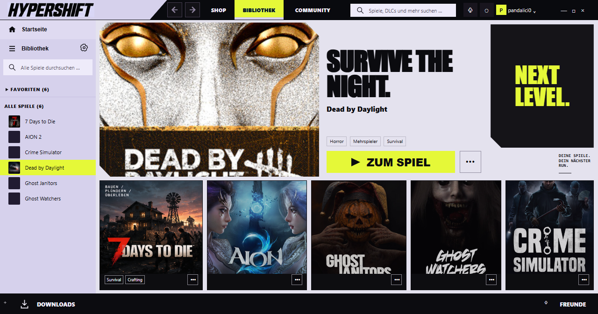
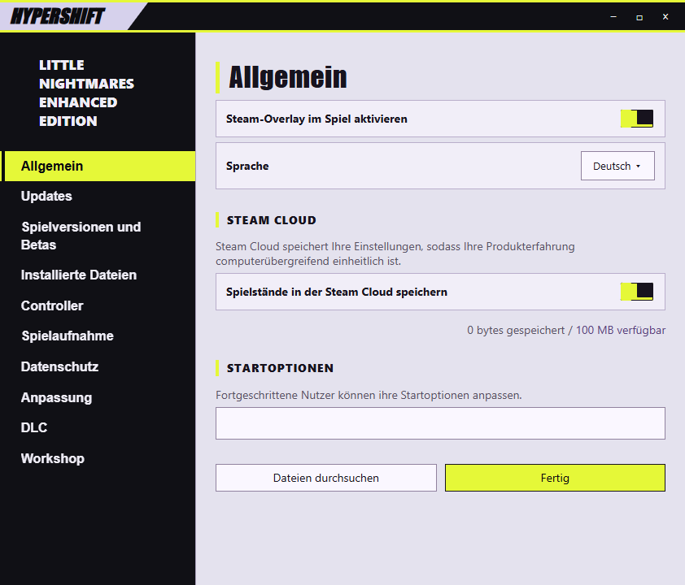

# HYPERSHIFT

**Ein Steam-Desktop-Theme von pandalici0 für Millennium.**

Lavendel, Schwarz und Acid-Gelb. Große Schrift, klare Kontraste und kantige Flächen – von der Bibliothek bis zum Chat.

[English](README.md) · [Installation](docs/INSTALLATION.md) · [Änderungen](CHANGELOG.md) · [Downloads](https://github.com/pandalici0/HYPERSHIFT/releases)



## Enthalten

- Eigene Bibliotheksstartseite mit allen sichtbaren Spielen des aktuellen Steam-Kontos, Favoriten und direkter Suche.
- Überarbeitete Spielseiten: großer Spielbutton, getrenntes Statistikfenster und lesbare Errungenschaften.
- Animiertes Menü unter dem HYPERSHIFT-Logo, Zurück/Vorwärts und ausgerichtete Fensterbuttons.
- Downloads, Freundesliste, Chat, Desktop-Login, Steam Guard und Kontoauswahl.
- Millennium-Einstellungen, Konfigurationsfenster, Benachrichtigungen und das Desktop-Ingame-Overlay.
- Native Steam-Einstellungen, Spieleigenschaften, Speicher, Installation/Backup/Cloud, Serverbrowser und Medienverwaltung. Siehe [Fensterabdeckung](docs/WINDOW-COVERAGE.md).
- Passende Kontextmenüs; farbliche Akzente für Shop-Seiten und Big Picture.

Spiele, Spielzeit, Erfolge und Aktionen stammen aus Steam. Der Skin fügt keine fremden Spiele hinzu. Die Anmeldung erhält ausschließlich CSS: Steams native Authentifizierung bleibt erhalten. Die Veröffentlichung enthält keine persönliche Spieleliste, keinen lokalen Cache-Index und keine gerätespezifischen Pfade.

## Installation

Voraussetzung: Steam für Windows und installiertes [Millennium](https://steambrew.app/).

1. `HYPERSHIFT-Millennium-1.7.2.zip` aus den Releases herunterladen und entpacken.
2. Den Ordner `hypershift` in `millennium/themes/` innerhalb deiner Steam-Installation kopieren.
3. In Millenniums **Designs** HYPERSHIFT auswählen und Theme-JavaScript erlauben.
4. Theme neu laden. Bereits offene Freunde-, Chat- und Einstellungsfenster bei Bedarf neu öffnen.

Standardpfad: `C:\Program Files (x86)\Steam\millennium\themes\hypershift`.

Alternativ lässt sich der komplette Repository-Ordner dort verwenden; die fertigen Theme-Dateien liegen bereits im Hauptverzeichnis. Das Release-ZIP ist das kompakte Installationspaket. [Anleitung mit Updates, Entfernung und optionalem Installer](docs/INSTALLATION.md).

## Quellen und eigene Anpassungen

Bearbeitbare Vorlagen liegen in `src/theme/`. Der portable Builder benötigt Python 3.10 oder neuer und keine zusätzlichen Python-Pakete:

```sh
python tools/build.py
python tools/build.py --check --release
node --check libraryroot.custom.js
```

[Entwicklung und Tests](docs/DEVELOPMENT.md) · [Änderungsprotokoll](CHANGELOG.md).

## Vorschauen und Kompatibilität



Neu in 1.7.0: native Steam-Einstellungen, Spieleigenschaften und weitere Fenster. Diese Vorschau ist ein lokaler Testaufbau mit Steams Original-CSS.

Die Vorschauen verwenden lokale Testoberflächen mit Beispieldaten. Das bestätigte Design stammt aus 1.6.3; 1.6.4 übernimmt es und ermittelt Bibliotheksdaten während der Laufzeit aus Steam.

Entwickelt für den Windows-Steam-Desktop und Millennium 3.5.0. Zusätzliche Theme-Texte sind derzeit deutsch; Steams eigene Texte verwenden dessen eingestellte Sprache. Shop/Community erhalten Aktionsakzente. Big Picture bekommt Farbakzente und kein vollständiges Desktop-Layout.

Steam-Updates können native Klassen und interne Schnittstellen verändern. Die Bibliothekslogik von 1.6.4 wird mit Testoberflächen geprüft; das Desktop-Design von 1.6.3 wurde zusätzlich im laufenden Client bestätigt. Für Login, Benachrichtigungen und Overlay bestehen lokale Prüfungen, jedoch keine vollständige Live-Abdeckung aller Zustände.

Code und eigene Gestaltung stehen unter [MIT](LICENSE). Spielgrafiken und Marken sind davon ausgenommen; siehe [NOTICE.md](NOTICE.md). Autor: **pandalici0**.
