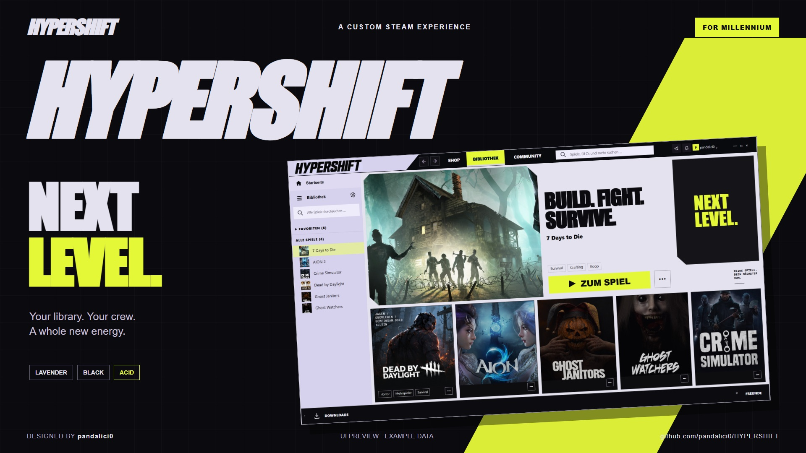
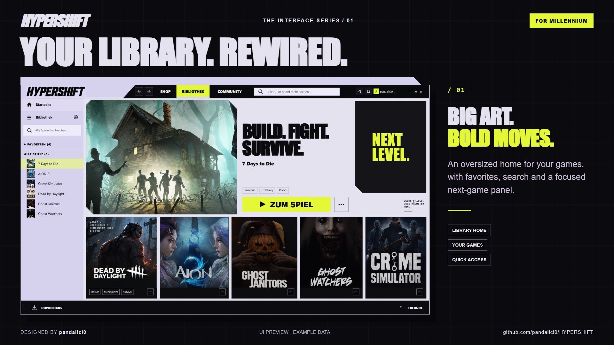
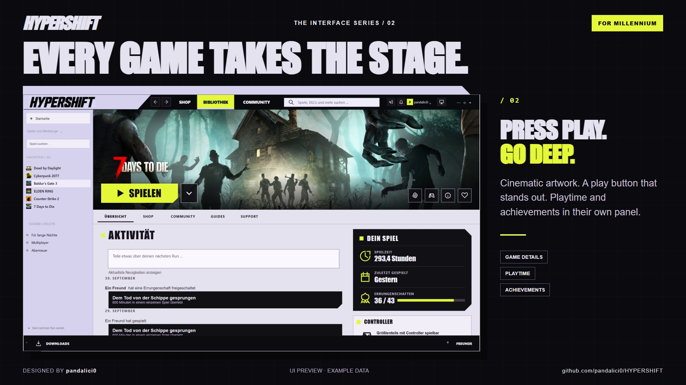
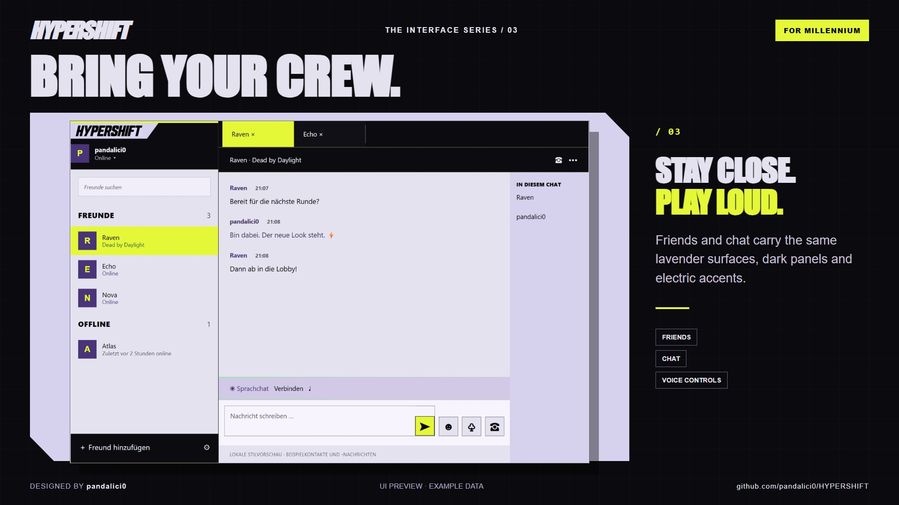
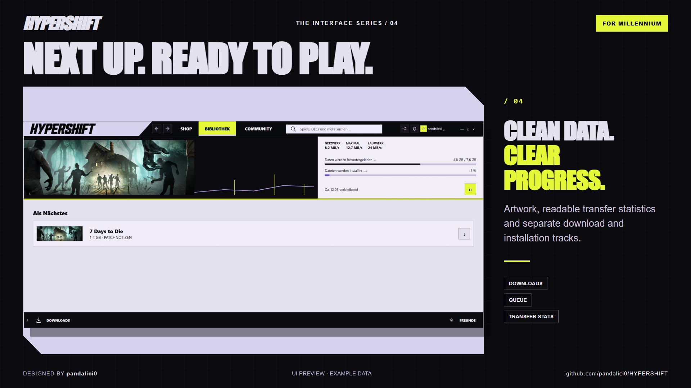
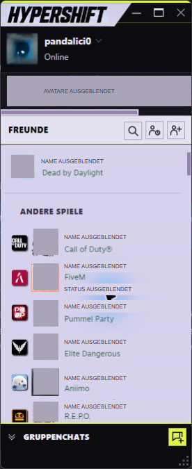
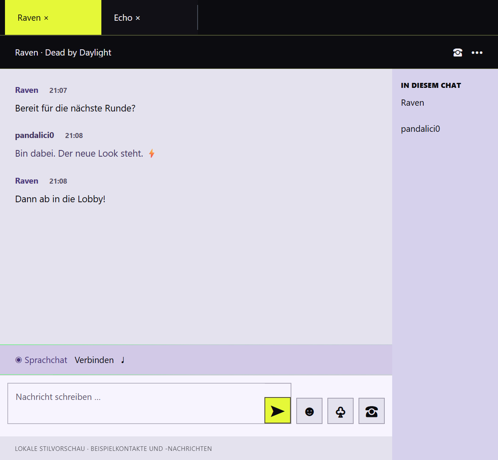

# HYPERSHIFT

**Your games. A whole new energy.**

HYPERSHIFT is a bold Steam desktop theme by **pandalici0**, built for **Millennium**. Lavender surfaces, deep black panels and acid-yellow actions give your library a striking new look, with oversized typography, cinematic game artwork and sharp geometric details.

[Deutsch](README.de.md) · [Installation](docs/INSTALLATION.md) · [Changes](CHANGELOG.md) · [Download releases](https://github.com/pandalici0/HYPERSHIFT/releases)



## What is included

- Custom library home with the current account's complete visible game list, favorites and local search.
- Game detail pages with a prominent play action, a separate statistics panel and readable achievement cards.
- Animated HYPERSHIFT header menu, native back/forward navigation and visible window controls.
- Downloads, friends, chat, desktop login, Steam Guard and account selection.
- Millennium settings, configuration dialogs, notifications and the desktop in-game overlay.
- Native Steam settings, properties, storage, install/backup/cloud dialogs, server browser and media controls. See [window coverage](docs/WINDOW-COVERAGE.md).
- Shared styling for native context menus; accent colors for store pages and Big Picture.
- Custom text that follows Steam's language, with support for all 30 selectable interface languages and optional Arabic.

The skin uses Steam's real games, statistics and controls. It does not add games to your library. Login is styled with CSS; native authentication stays in Steam. No account inventory, local cache index or machine-specific path is bundled in this release.

## Install

Requires Steam desktop on Windows and an installed [Millennium](https://steambrew.app/).

1. Download `HYPERSHIFT-Millennium-1.8.0.zip` from Releases and extract it.
2. Place the included `hypershift` folder inside your Steam installation's `millennium/themes/` directory.
3. Select **HYPERSHIFT** in Millennium's Designs/Themes settings, and enable JavaScript for this theme.
4. Reload the theme. Reopen friends/chat/settings windows if they still show their previous appearance.

The repository also has ready-built files: a clone or source archive can be placed in `millennium/themes/hypershift` directly. For a clean end-user download, prefer the release ZIP. See [installation, updating and removal](docs/INSTALLATION.md) for details and an optional installer with backups.

## More previews

| Library | Game details |
| --- | --- |
|  |  |

| Friends & chat | Downloads |
| --- | --- |
|  |  |

[Full preview gallery and image sizes](docs/PREVIEWS.md). PNG originals and lighter JPG versions are included.

| Friends | Chat |
| --- | --- |
|  |  |

All gallery images are screenshots from the running Windows Steam client with HYPERSHIFT 1.8.0, captured in English on 6 October 2026. Contact names and third-party avatars are visibly masked, including the clipped activity contact on the game detail page. The chat was empty and the download queue was empty at capture time. The promotional frames do not change the captured interface. Game artwork and trademarks belong to their owners.

## Development

The theme files at the repository root are ready to install. Edit templates in `src/theme/`, then rebuild with Python 3.10 or newer:

```sh
python tools/build.py
python tools/build.py --check --release
node --check libraryroot.custom.js
```

The builder uses the Python standard library and needs neither Steam nor a local game cache. It embeds the original artwork atlas in the runtime CSS/JavaScript. See [development and tests](docs/DEVELOPMENT.md).

## Compatibility

The desktop design was developed against the Windows Steam UI and Millennium 3.5.0. Theme labels follow Steam's configured language across all 30 selectable interface languages; optional Arabic is also included. See [language support](docs/LOCALIZATION.md). Store/community pages receive action accents rather than a replacement page layout. Big Picture gets a color accent patch, not the full desktop layout.

Steam updates can change native CSS classes and internal stores. Automated fixtures verify layout and interaction logic but cannot guarantee future client compatibility. The account-independent 1.6.4 library discovery is fixture-tested; the established 1.6.3 desktop design was also confirmed in a running client. Login, notifications and overlay have local fixture coverage; not every live-game or login state has been exercised.

## License

Code and original interface styling: [MIT](LICENSE), copyright 2026 pandalici0. Steam/game trademarks and game imagery are excluded from that license; see [asset notices](NOTICE.md). This project is independent of Valve and Millennium.
