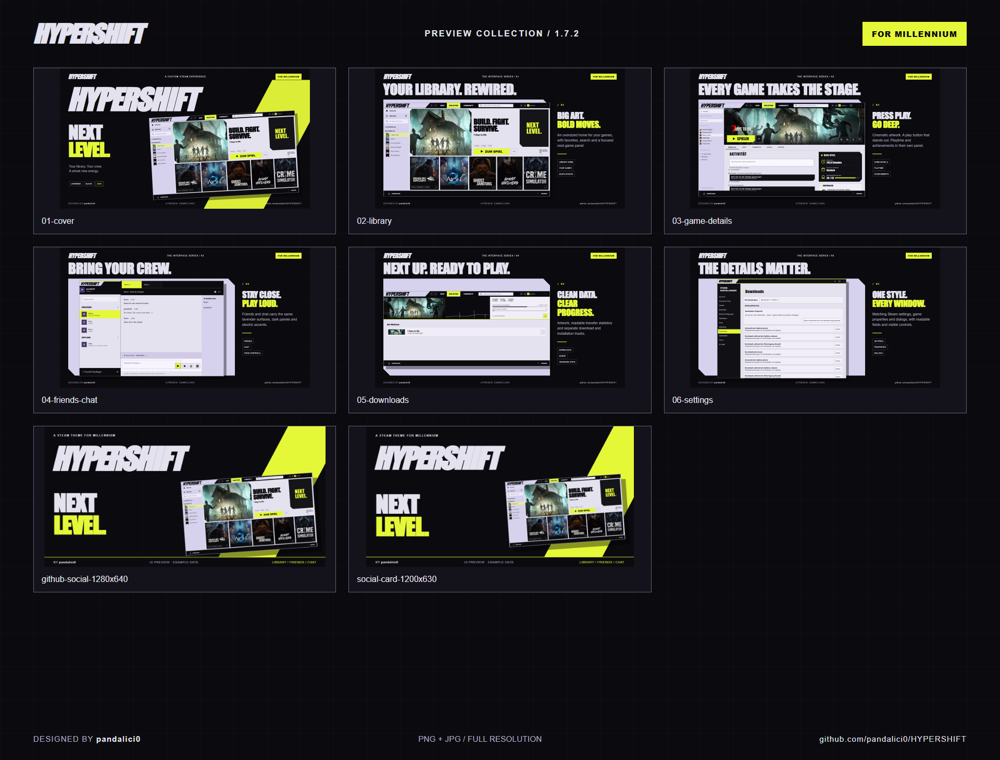

# HYPERSHIFT preview kit

By **pandalici0**, based on HYPERSHIFT **1.7.2**.

The promotional images use the current theme's CSS and UI models with example data. Contacts, messages, statistics and downloads are illustrative. These are not live-account captures. Game imagery and trademarks remain excluded from the MIT code license; see [NOTICE](../NOTICE.md).

## Promotional images

| File | Pixels | Use |
| --- | --- | --- |
| [01-cover](images/promo/01-cover.png) | 1920 × 1080 | README banner, release announcement |
| [02-library](images/promo/02-library.png) | 1920 × 1080 | Library showcase |
| [03-game-details](images/promo/03-game-details.png) | 1920 × 1080 | Play button, statistics and achievements |
| [04-friends-chat](images/promo/04-friends-chat.png) | 1920 × 1080 | Friends, chat and voice controls |
| [05-downloads](images/promo/05-downloads.png) | 1920 × 1080 | Transfer graph, progress and queue |
| [06-settings](images/promo/06-settings.png) | 1920 × 1080 | Settings and dialog styling |
| [github-social-1280x640](images/promo/github-social-1280x640.png) | 1280 × 640 | Repository social preview |
| [social-card-1200x630](images/promo/social-card-1200x630.png) | 1200 × 630 | Link preview / social post |

Each image has a PNG original and a JPG version with the same name. Use JPG for lightweight README embeds and PNG when preserving fine UI text matters.



## Unframed UI views

- [Library](images/library.png)
- [Game details](images/game-details.png)
- [Friends and chat](images/social.png), plus separate [friends](images/friends.png) and [chat](images/chat.png) views
- [Downloads](images/downloads.png)
- [Steam settings](images/settings.png)
- [Game properties](images/properties.png)
- [Steam menu](images/steam-menu.png)

## Rebuild the promotional layouts

The current captures are the inputs. The compositor uses HTML/CSS and Playwright, without remote assets or access to Steam.

```sh
npm install
npx playwright install chromium
node tools/render-previews.cjs
```

On Windows with Edge installed, set `HYPERSHIFT_BROWSER_CHANNEL=msedge`. The artwork uses local Impact/Arial fonts; font substitution on other systems can change typography.

Deutsch: Für die README `01-cover.jpg` verwenden. Die fünf Showcase-Motive zeigen die Bereiche im Detail. `github-social-1280x640.png` ist für die Repository-Linkvorschau vorbereitet. PNG und JPG sowie die reinen UI-Bilder sind im Paket enthalten. Alle Kontakte und Nachrichten sind Beispieldaten.
